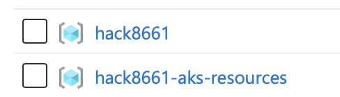

# WhatTheHack039


## Repository Structure and Student Guide
This project contains all resource for this hack. Over multiple challenges the reference solution will be build up. 

Each step is represented by a branch. The branch name is the challenge number. The corresponding solution branch contains the solution for the challenge. The next challenge branch contains the solution for the previous challenge plus the new challenge.

Branches
- main (Starting point)
- 01/challenge (First challenge)
- 01/solution (Solution for the first challenge)
- 02/challenge (Second challenge)
- 02/solution (Solution for the second challenge)
- ...

Please refer to the [Student Guide](Student_Guide) directory for detailed instructions on the different steps. It contains a readme for each step describing the challenge, the success criteria and learning resources.

After checking out a challenge branch you'll find a couple of TODOs in the code. Ideally you use a IDE or IDE plugin that does list all TODO comments for you. These TODOs are the tasks you need to complete to solve the challenge. The solution branch contains the completed tasks. 

## Reference Solution
The infrastructure is defined in Terraform, a descriptive Infrastructure-as-Code technology. The infrastructure is provisioned in two stages

* Azure
* Kubernetes

Azure contains the whole Azure parts and includes a Azure Kubernetes Service (AKS). The second stage provisions resources in the AKS.

## Requirements

* Azure subscription
* Contributor permissions on this subscription
* The following tools
  * az (Azure CLI)
  * terraform
  * kubectl
  * helm
  * kubelogin

### Install the Azure part

Go to the Azure directory. Login to Azure, either

```shell
az login
```

for human login or

```shell
az login --service-principal -u <username> -p <password>
```

in case you have a service principal. Switch to the right subscription using

```shell
az account set --subscription <subscription-id>
```

And then run

```shell
terraform init
```

to install all Terraform providers and modules. After that create the infrastructure running

```shell
terraform apply
```

Terraform will create a plan that you can confirm by typing "yes" upon question. You will find the following resource groups in the subscription

* hack<random>XXXX
* hackXXXX-aks-resources



In the subscription hackXXX you will find the following:


Terraform automatically loads the credentials to your local kubectl environment. So this command should work:

```
$ kubectl version                                                                                        ✔  hack8661 ⎈ 
Client Version: v1.28.2
Kustomize Version: v5.0.4-0.20230601165947-6ce0bf390ce3
Server Version: v1.27.3
```

and

```bash
$ kubectl get nodes                                                                                         ✔  hack8661 ⎈ 
NAME                                 STATUS   ROLES   AGE     VERSION
aks-exnodepool-29187889-vmss000000   Ready    agent   2d17h   v1.27.3
```

### Install the Kubernetes part

Go to the Kubernetes directory. We need to define the value for the variable email_adress like so

```bash
echo email_address=<your-email-address> >terraform.auto.tfvars
```

This file is picked automatically and is ignored by git. Run

```shell
terraform init
```

and then

```shell
terraform apply
```

again, confirm with "yes" when asked.

### Verify the result

You should be able to see the following

* ingress-nginx is installed
  * The ingress-nginx has a public IP address
* cert-manager is installed
  * Clusterissuer "letsencrypt-prod" (with your email address)
* kube-prometheus-stack installed
* Namespace "hack"
  * Deployment "api"
    * Reading the secrets for SQL_SERVER_PASSWORD from the KeyVault
    * Horizonal Pod Autoscaler
    * Persitent Volume Claim of type RWX which uses a file share on a storage account
    * Ingress using traefik.me
    * Certificate issued by Let's Encrypt
  * Deployment "web"
    * Horizional Pod Autoscaler
    * Ingress using traefik.me
    * Certificate issued by Let's Encrypt

### Tearing down

Run the command

```shell
terraform destroy
```

first in the Kubernetes, then Azure parts (reverse order)
